# Hackapizza 2.0 — Statistical Analysis

**Dataset:** 287 recipes, 62 unique ingredients

---

## 1. Descriptive Statistics

### Core Metrics

|       |   prestige |   prep_s |   n_ingredients |
|:------|-----------:|---------:|----------------:|
| count |     287    |   287    |          287    |
| mean  |      62.77 |     9    |            6.86 |
| std   |      16.91 |     3.48 |            1.63 |
| min   |      23    |     3    |            5    |
| 25%   |      50    |     6    |            5    |
| 50%   |      62    |     9    |            7    |
| 75%   |      75    |    12    |            8    |
| max   |     100    |    15    |           11    |

### Prestige Distribution

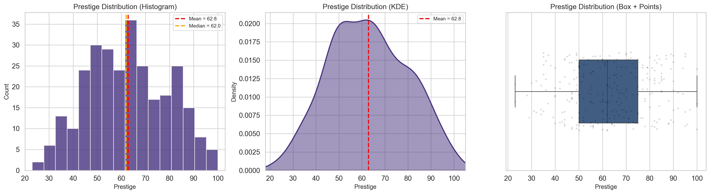

### Preparation Time Distribution

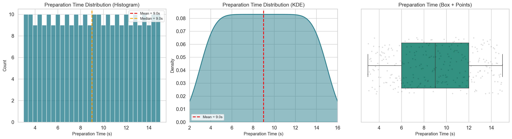

### Ingredient Count Distribution

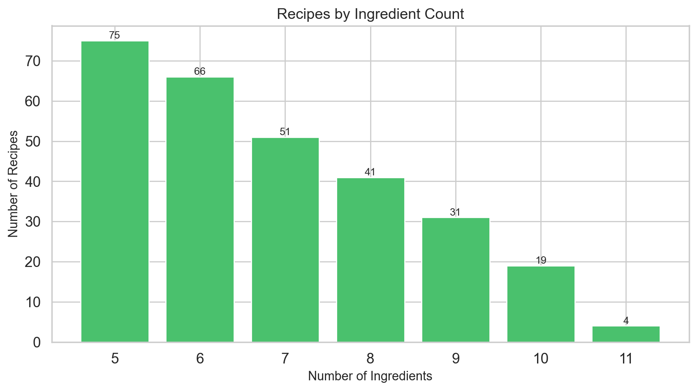

## 2. Correlational Analysis

### 2a. Number of Ingredients vs Prestige

- **Pearson r** = 0.1704 (p = 3.7928e-03)
- **Spearman ρ** = 0.1719 (p = 3.4813e-03)

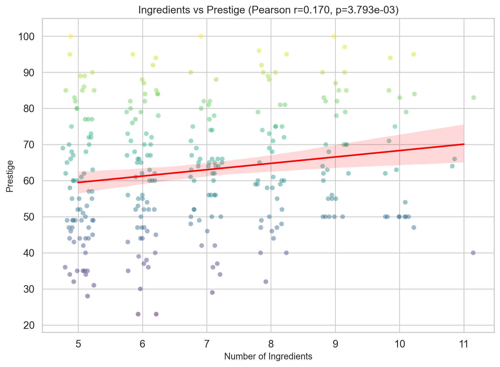

#### Mean Prestige by Ingredient Count

|   n_ingredients |   mean |   median |   std |   count |
|----------------:|-------:|---------:|------:|--------:|
|               5 |  59.05 |       57 | 17.68 |      75 |
|               6 |  61.59 |       62 | 17.61 |      66 |
|               7 |  62.29 |       64 | 14.82 |      51 |
|               8 |  65.41 |       61 | 16.83 |      41 |
|               9 |  69.94 |       70 | 15.23 |      31 |
|              10 |  65.37 |       62 | 16.98 |      19 |
|              11 |  63.25 |       65 | 17.69 |       4 |

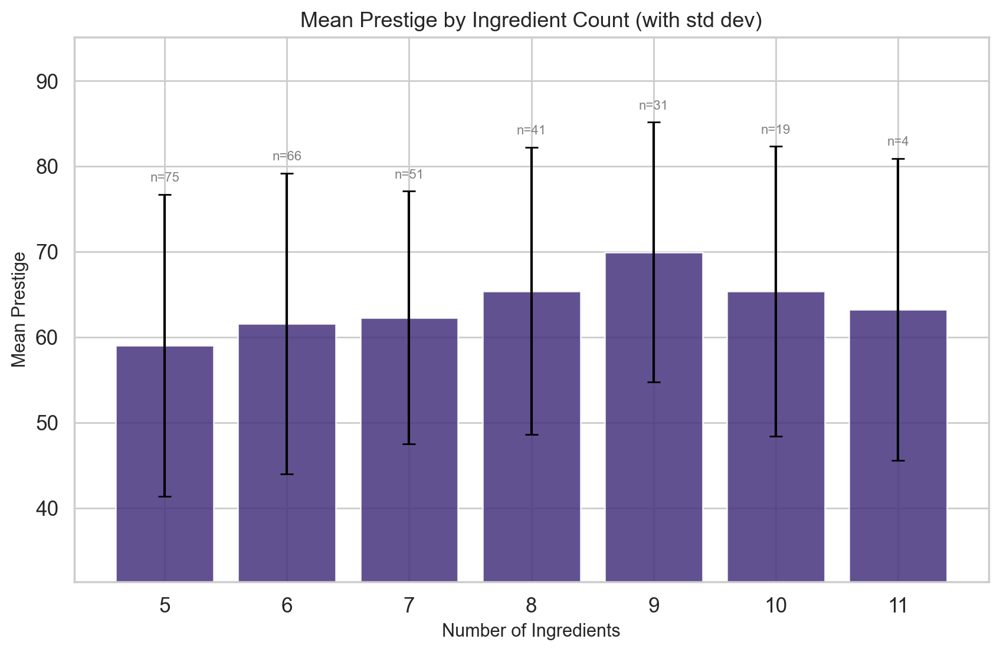

### 2b. Preparation Time vs Prestige

- **Pearson r** = -0.1224 (p = 3.8220e-02)
- **Spearman ρ** = -0.1160 (p = 4.9548e-02)

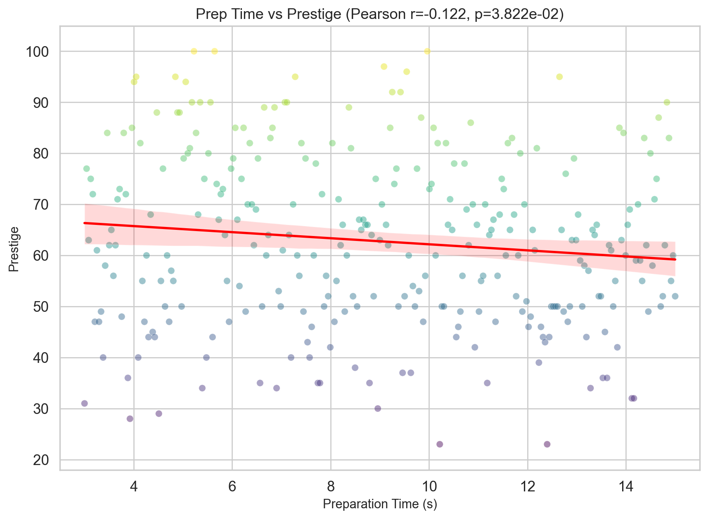

### 2c. Preparation Time vs Number of Ingredients

- **Pearson r** = 0.0983 (p = 9.6619e-02)
- **Spearman ρ** = 0.1040 (p = 7.8717e-02)

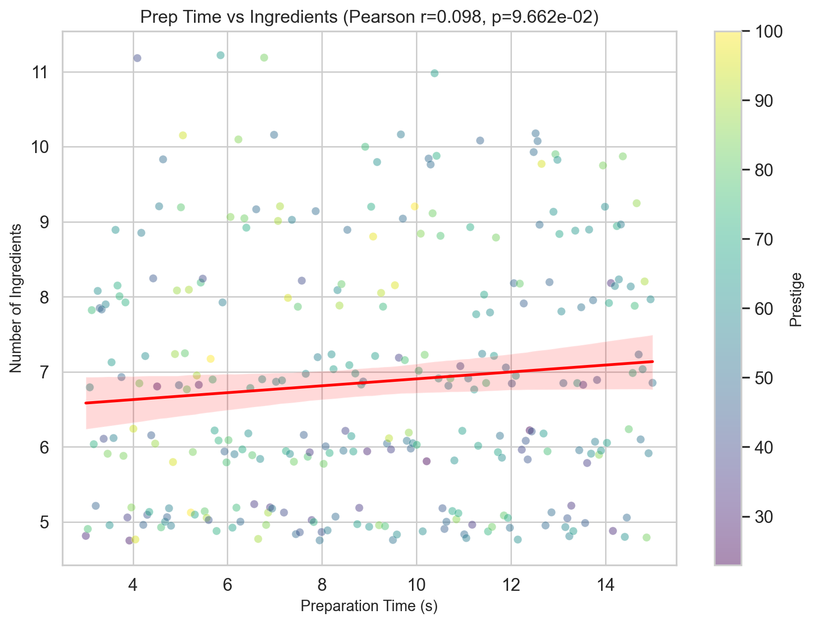

### 2d. Correlation Matrix

|               |   Prestige |   Prep Time (s) |   # Ingredients |
|:--------------|-----------:|----------------:|----------------:|
| Prestige      |     1      |         -0.1224 |          0.1704 |
| Prep Time (s) |    -0.1224 |          1      |          0.0983 |
| # Ingredients |     0.1704 |          0.0983 |          1      |

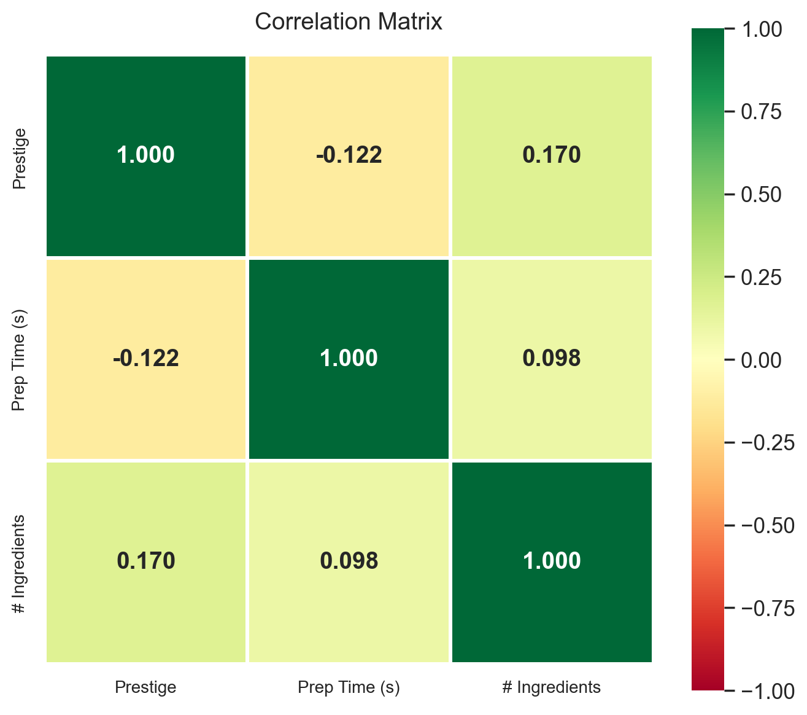

## 3. Ingredient Analysis

### 3a. Ingredient Frequency (Top 30)

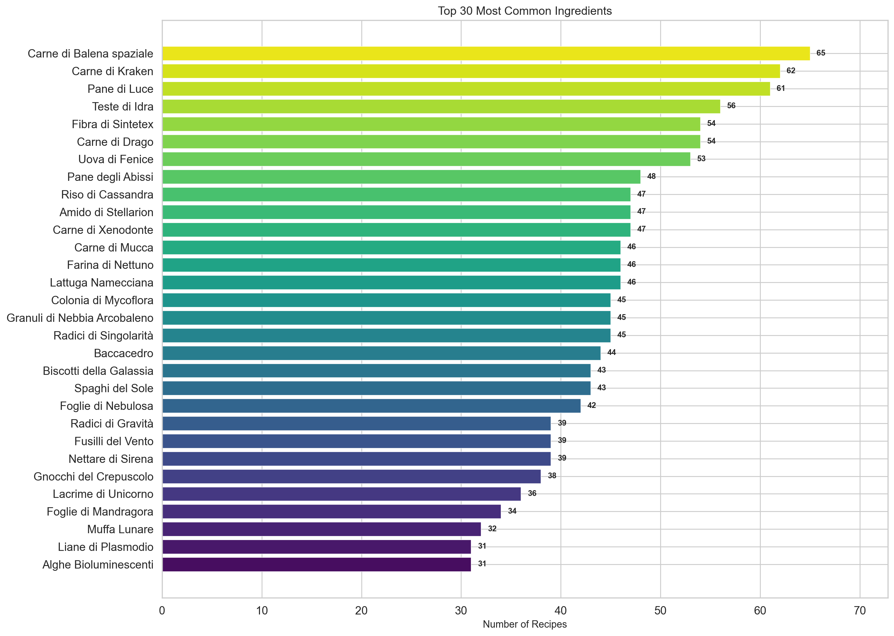

### 3b. Ingredient Impact on Prestige

Mean prestige of recipes containing each ingredient vs. recipes without it.

#### Ingredients Ranked by Prestige Impact (Δ = mean_with - mean_without)

| ingredient                   |   mean_with |   mean_without |   delta |   count |   p_value |
|:-----------------------------|------------:|---------------:|--------:|--------:|----------:|
| Polvere di Crononite         |       71.81 |          61.87 |    9.93 |      26 |      0    |
| Shard di Prisma Stellare     |       70.88 |          62.03 |    8.84 |      24 |      0.01 |
| Lacrime di Andromeda         |       70.25 |          61.97 |    8.28 |      28 |      0.02 |
| Frutti del Diavolo           |       68.62 |          62.31 |    6.31 |      21 |      0.06 |
| Essenza di Tachioni          |       68.16 |          62.12 |    6.04 |      31 |      0.04 |
| Gnocchi del Crepuscolo       |       67.16 |          62.1  |    5.05 |      38 |      0.14 |
| Polvere di Stelle            |       67.14 |          62.3  |    4.84 |      28 |      0.2  |
| Teste di Idra                |       66.25 |          61.93 |    4.32 |      56 |      0.09 |
| Shard di Materia Oscura      |       66.31 |          62.38 |    3.93 |      29 |      0.21 |
| Spore Quantiche              |       66.42 |          62.51 |    3.91 |      19 |      0.25 |
| Sale Temporale               |       66.19 |          62.42 |    3.77 |      27 |      0.28 |
| Riso di Cassandra            |       65.85 |          62.17 |    3.68 |      47 |      0.23 |
| Uova di Fenice               |       65.72 |          62.11 |    3.61 |      53 |      0.15 |
| Carne di Mucca               |       65.63 |          62.23 |    3.4  |      46 |      0.26 |
| Spaghi del Sole              |       64.95 |          62.39 |    2.56 |      43 |      0.36 |
| Biscotti della Galassia      |       64.91 |          62.4  |    2.51 |      43 |      0.36 |
| Nduja Fritta Tanto           |       64.96 |          62.54 |    2.43 |      28 |      0.41 |
| Frammenti di Supernova       |       64.84 |          62.58 |    2.26 |      25 |      0.53 |
| Granuli di Nebbia Arcobaleno |       64.64 |          62.43 |    2.22 |      45 |      0.43 |
| Petali di Eco                |       64.75 |          62.56 |    2.19 |      28 |      0.44 |
| Muffa Lunare                 |       64.53 |          62.55 |    1.98 |      32 |      0.52 |
| Fibra di Sintetex            |       64    |          62.49 |    1.51 |      54 |      0.53 |
| Colonia di Mycoflora         |       64    |          62.55 |    1.45 |      45 |      0.58 |
| Carne di Balena spaziale     |       63.75 |          62.49 |    1.27 |      65 |      0.58 |
| Amido di Stellarion          |       63.43 |          62.65 |    0.78 |      47 |      0.76 |
| Carne di Xenodonte           |       63.38 |          62.65 |    0.73 |      47 |      0.8  |
| Essenza di Vuoto             |       63.41 |          62.7  |    0.71 |      29 |      0.85 |
| Pane degli Abissi            |       63.12 |          62.7  |    0.42 |      48 |      0.88 |
| Carne di Kraken              |       63.02 |          62.71 |    0.31 |      62 |      0.9  |
| Radici di Singolarità        |       62.78 |          62.77 |    0.01 |      45 |      1    |
| Erba Pipa                    |       62.74 |          62.78 |   -0.04 |      23 |      0.99 |
| Plasma Vitale                |       62.56 |          62.79 |   -0.23 |      25 |      0.95 |
| Farina di Nettuno            |       62.41 |          62.84 |   -0.43 |      46 |      0.88 |
| Cristalli di Memoria         |       62.26 |          62.82 |   -0.56 |      23 |      0.88 |
| Liane di Plasmodio           |       62.26 |          62.84 |   -0.58 |      31 |      0.86 |
| Foglie di Nebulosa           |       62.14 |          62.88 |   -0.74 |      42 |      0.82 |
| Radici di Gravità            |       62.13 |          62.88 |   -0.75 |      39 |      0.81 |
| Fusilli del Vento            |       61.92 |          62.91 |   -0.98 |      39 |      0.68 |
| Funghi Orbitali              |       61.52 |          62.91 |   -1.4  |      29 |      0.7  |
| Vero Ghiaccio                |       61.44 |          62.91 |   -1.47 |      27 |      0.66 |
| Foglie di Mandragora         |       61.35 |          62.96 |   -1.61 |      34 |      0.6  |
| Polvere di Pulsar            |       61.04 |          62.95 |   -1.91 |      26 |      0.62 |
| Lacrime di Unicorno          |       61    |          63.03 |   -2.03 |      36 |      0.49 |
| Alghe Bioluminescenti        |       60.77 |          63.02 |   -2.24 |      31 |      0.49 |
| Baccacedro                   |       60.77 |          63.14 |   -2.36 |      44 |      0.41 |
| Carne di Drago               |       60.83 |          63.22 |   -2.39 |      54 |      0.3  |
| Nettare di Sirena            |       59.72 |          63.25 |   -3.54 |      39 |      0.23 |
| Funghi dell’Etere            |       59.59 |          63.13 |   -3.55 |      29 |      0.34 |
| Lattuga Namecciana           |       59.76 |          63.35 |   -3.59 |      46 |      0.2  |
| Essenza di Speziaria         |       59.07 |          63.19 |   -4.12 |      29 |      0.17 |
| Pane di Luce                 |       59.38 |          63.69 |   -4.31 |      61 |      0.05 |
| Cristalli di Nebulite        |       56.05 |          63.33 |   -7.29 |      22 |      0.08 |
| Salsa Szechuan               |       54.46 |          63.6  |   -9.14 |      26 |      0.01 |

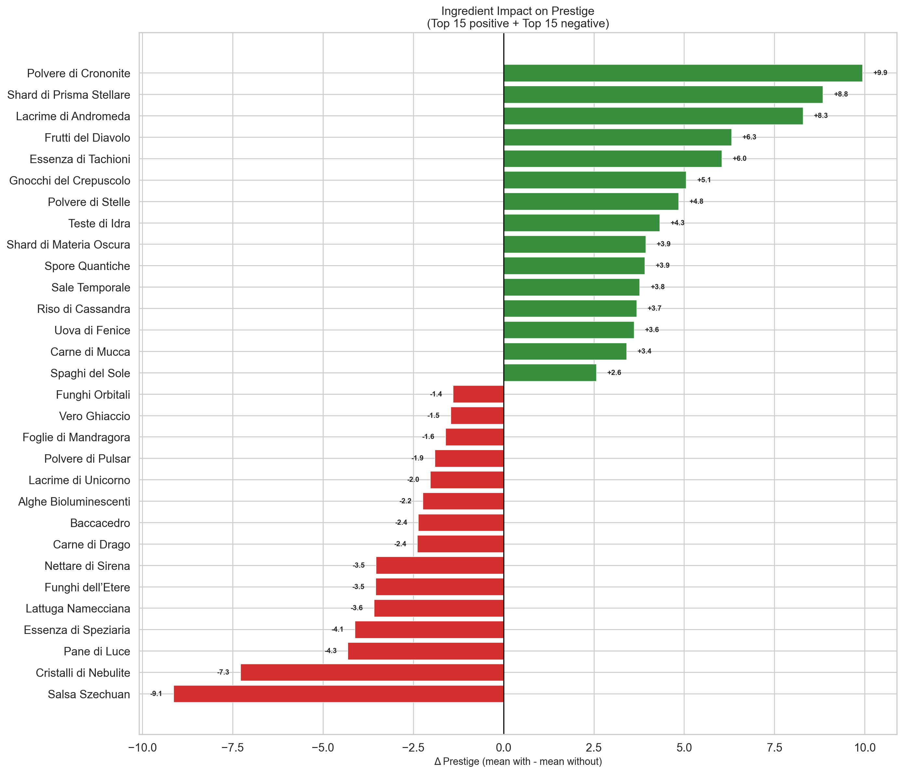

### 3c. Ingredient Co-occurrence Analysis

Which ingredient pairs appear together most often?

#### Top 25 Ingredient Pairs

| # | Ingredient 1 | Ingredient 2 | Co-occurrences |
|---|-------------|-------------|----------------|
| 1 | Carne di Balena spaziale | Pane di Luce | 19 |
| 2 | Carne di Drago | Pane di Luce | 18 |
| 3 | Carne di Kraken | Pane di Luce | 18 |
| 4 | Carne di Balena spaziale | Fibra di Sintetex | 17 |
| 5 | Carne di Balena spaziale | Carne di Kraken | 16 |
| 6 | Amido di Stellarion | Carne di Kraken | 14 |
| 7 | Carne di Xenodonte | Teste di Idra | 14 |
| 8 | Fibra di Sintetex | Foglie di Nebulosa | 14 |
| 9 | Carne di Balena spaziale | Teste di Idra | 14 |
| 10 | Carne di Drago | Teste di Idra | 13 |
| 11 | Amido di Stellarion | Carne di Drago | 13 |
| 12 | Radici di Singolarità | Uova di Fenice | 13 |
| 13 | Carne di Xenodonte | Pane degli Abissi | 12 |
| 14 | Carne di Kraken | Carne di Xenodonte | 12 |
| 15 | Carne di Kraken | Fibra di Sintetex | 12 |
| 16 | Carne di Drago | Riso di Cassandra | 12 |
| 17 | Riso di Cassandra | Teste di Idra | 12 |
| 18 | Pane di Luce | Radici di Singolarità | 12 |
| 19 | Baccacedro | Granuli di Nebbia Arcobaleno | 12 |
| 20 | Carne di Kraken | Uova di Fenice | 12 |
| 21 | Carne di Mucca | Riso di Cassandra | 12 |
| 22 | Pane di Luce | Spaghi del Sole | 12 |
| 23 | Pane degli Abissi | Pane di Luce | 12 |
| 24 | Carne di Balena spaziale | Uova di Fenice | 12 |
| 25 | Carne di Balena spaziale | Pane degli Abissi | 11 |

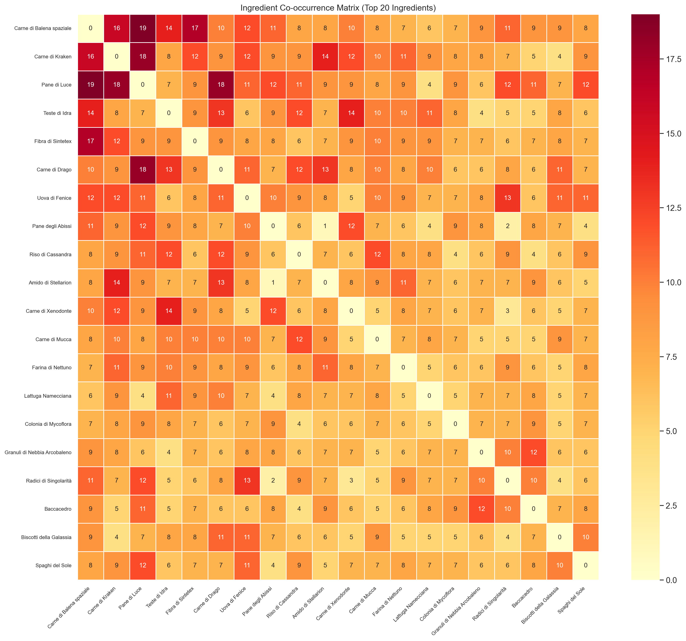

## 4. Prestige Tier Analysis

### Tier Breakdown

| tier       |   count |   mean_prestige |   mean_ingredients |   mean_prep_s |
|:-----------|--------:|----------------:|-------------------:|--------------:|
| S (90-100) |      19 |           93.95 |               7.53 |          7.43 |
| A (80-89)  |      38 |           83.97 |               7    |          8.49 |
| B (70-79)  |      43 |           74.09 |               7    |          8.21 |
| C (60-69)  |      65 |           63.86 |               6.88 |          9.56 |
| D (50-59)  |      56 |           53.3  |               7.3  |         10.11 |
| E (<50)    |      66 |           41.18 |               6.11 |          8.77 |

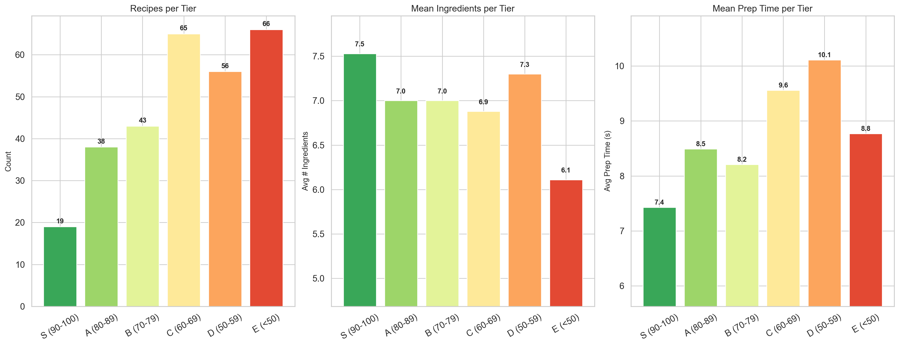

### Ingredient Count by Tier (Violin Plot)

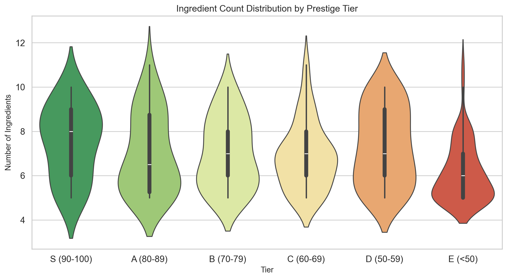

## 5. Ingredient Presence in Top-Tier Recipes

How often does each ingredient appear in S-tier (prestige ≥ 90) vs overall?

#### Ingredient Enrichment in S-Tier Recipes

Enrichment ratio > 1 means the ingredient is *over-represented* in top recipes.

| ingredient                   |   s_tier_count |   total_count |   pct_in_s_tier |   pct_overall |   enrichment_ratio |
|:-----------------------------|---------------:|--------------:|----------------:|--------------:|-------------------:|
| Cioccorane                   |              1 |             1 |             5.3 |           0.3 |              15.11 |
| Polvere di Stelle            |              6 |            28 |            31.6 |           9.8 |               3.24 |
| Lacrime di Andromeda         |              6 |            28 |            31.6 |           9.8 |               3.24 |
| Frammenti di Supernova       |              4 |            25 |            21.1 |           8.7 |               2.42 |
| Essenza di Vuoto             |              4 |            29 |            21.1 |          10.1 |               2.08 |
| Carne di Mucca               |              6 |            46 |            31.6 |          16   |               1.97 |
| Riso di Cassandra            |              6 |            47 |            31.6 |          16.4 |               1.93 |
| Shard di Prisma Stellare     |              3 |            24 |            15.8 |           8.4 |               1.89 |
| Plasma Vitale                |              3 |            25 |            15.8 |           8.7 |               1.81 |
| Foglie di Nebulosa           |              5 |            42 |            26.3 |          14.6 |               1.8  |
| Polvere di Crononite         |              3 |            26 |            15.8 |           9.1 |               1.74 |
| Polvere di Pulsar            |              3 |            26 |            15.8 |           9.1 |               1.74 |
| Teste di Idra                |              6 |            56 |            31.6 |          19.5 |               1.62 |
| Carne di Xenodonte           |              5 |            47 |            26.3 |          16.4 |               1.61 |
| Gnocchi del Crepuscolo       |              4 |            38 |            21.1 |          13.2 |               1.59 |
| Uova di Fenice               |              5 |            53 |            26.3 |          18.5 |               1.43 |
| Spaghi del Sole              |              4 |            43 |            21.1 |          15   |               1.41 |
| Carne di Kraken              |              5 |            62 |            26.3 |          21.6 |               1.22 |
| Carne di Balena spaziale     |              5 |            65 |            26.3 |          22.6 |               1.16 |
| Sale Temporale               |              2 |            27 |            10.5 |           9.4 |               1.12 |
| Fibra di Sintetex            |              4 |            54 |            21.1 |          18.8 |               1.12 |
| Vero Ghiaccio                |              2 |            27 |            10.5 |           9.4 |               1.12 |
| Nduja Fritta Tanto           |              2 |            28 |            10.5 |           9.8 |               1.08 |
| Shard di Materia Oscura      |              2 |            29 |            10.5 |          10.1 |               1.04 |
| Funghi dell’Etere            |              2 |            29 |            10.5 |          10.1 |               1.04 |
| Colonia di Mycoflora         |              3 |            45 |            15.8 |          15.7 |               1.01 |
| Farina di Nettuno            |              3 |            46 |            15.8 |          16   |               0.99 |
| Alghe Bioluminescenti        |              2 |            31 |            10.5 |          10.8 |               0.97 |
| Amido di Stellarion          |              3 |            47 |            15.8 |          16.4 |               0.96 |
| Muffa Lunare                 |              2 |            32 |            10.5 |          11.1 |               0.94 |
| Pane degli Abissi            |              3 |            48 |            15.8 |          16.7 |               0.94 |
| Lacrime di Unicorno          |              2 |            36 |            10.5 |          12.5 |               0.84 |
| Radici di Gravità            |              2 |            39 |            10.5 |          13.6 |               0.77 |
| Nettare di Sirena            |              2 |            39 |            10.5 |          13.6 |               0.77 |
| Pane di Luce                 |              3 |            61 |            15.8 |          21.3 |               0.74 |
| Frutti del Diavolo           |              1 |            21 |             5.3 |           7.3 |               0.72 |
| Biscotti della Galassia      |              2 |            43 |            10.5 |          15   |               0.7  |
| Baccacedro                   |              2 |            44 |            10.5 |          15.3 |               0.69 |
| Granuli di Nebbia Arcobaleno |              2 |            45 |            10.5 |          15.7 |               0.67 |
| Erba Pipa                    |              1 |            23 |             5.3 |           8   |               0.66 |
| Lattuga Namecciana           |              2 |            46 |            10.5 |          16   |               0.66 |
| Cristalli di Memoria         |              1 |            23 |             5.3 |           8   |               0.66 |
| Carne di Drago               |              2 |            54 |            10.5 |          18.8 |               0.56 |
| Petali di Eco                |              1 |            28 |             5.3 |           9.8 |               0.54 |
| Funghi Orbitali              |              1 |            29 |             5.3 |          10.1 |               0.52 |
| Liane di Plasmodio           |              1 |            31 |             5.3 |          10.8 |               0.49 |
| Essenza di Tachioni          |              1 |            31 |             5.3 |          10.8 |               0.49 |
| Foglie di Mandragora         |              1 |            34 |             5.3 |          11.8 |               0.44 |
| Fusilli del Vento            |              1 |            39 |             5.3 |          13.6 |               0.39 |
| Radici di Singolarità        |              1 |            45 |             5.3 |          15.7 |               0.34 |

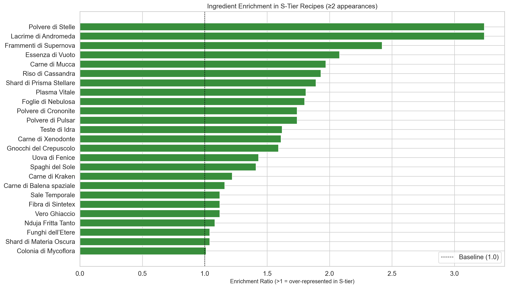

## 6. Prestige Efficiency Analysis

Which recipes give the most prestige per ingredient? Per second of prep time?

### Top 20 Recipes by Prestige per Ingredient

| name                                                                                                                            |   prestige |   n_ingredients |   prestige_per_ing |   prep_s |
|:--------------------------------------------------------------------------------------------------------------------------------|-----------:|----------------:|-------------------:|---------:|
| Portale Cosmico: Sinfonia di Gnocchi del Crepuscolo con Essenza di Tachioni e Sfumature di Fenice                               |        100 |               5 |              20    |    5.224 |
| Sinfonia Temporale di Fenice e Xenodonte su Pane degli Abissi con Colata di Plasma Vitale e Polvere di Crononite                |         95 |               5 |              19    |    4.049 |
| Sinfonia di Multiverso: La Danza degli Elementi                                                                                 |         90 |               5 |              18    |    5.559 |
| Sinfonia Aromatica del Multiverso                                                                                               |         89 |               5 |              17.8  |    6.65  |
| Viaggio Cosmico nel Multiverso                                                                                                  |         89 |               5 |              17.8  |    6.86  |
| Piastrella Celestiale di Gnocchi del Crepuscolo con Nebulosa di Riso di Cassandra, Lacrime di Unicorno e Velo di Materia Oscura |         86 |               5 |              17.2  |   10.846 |
| Sinfonia del Multiverso Calante                                                                                                 |         85 |               5 |              17    |    3.965 |
| Sinfonia Cosmica di Terracotta                                                                                                  |         85 |               5 |              17    |    6.818 |
| Sinfonia Cosmica di Andromeda                                                                                                   |         85 |               5 |              17    |    9.21  |
| Sinfonia Temporale delle Profondità Infrasoniche                                                                                |         83 |               5 |              16.6  |   14.874 |
| Sinfonia Cosmica: il Ritorno dell'Imperatore                                                                                    |         82 |               5 |              16.4  |   11.601 |
| Sinfonia del Multiverso                                                                                                         |         80 |               5 |              16    |    5.517 |
| Galassia di Sapori: Sinfonia Transdimensionale                                                                                  |         80 |               5 |              16    |   11.853 |
| Più-dimensionale Sinfonia di Sapori: La Carne del Cosmo                                                                         |         95 |               6 |              15.83 |    4.846 |
| Sinfonia Quantica dell'Oceano Interstellare                                                                                     |         94 |               6 |              15.67 |    4.007 |
| Sinfonia Cosmica di Proteine Interstellari                                                                                      |         77 |               5 |              15.4  |    3.042 |
| Sinfonia Cosmica di Mare e Stelle                                                                                               |         77 |               5 |              15.4  |    4.594 |
| Sinfonia Celestiale di Echi Galattici                                                                                           |         77 |               5 |              15.4  |    9.336 |
| Sinfonia Celeste dell'Equilibrio Temporale                                                                                      |         92 |               6 |              15.33 |    9.42  |
| Nebulosa di Fenice con Sinfonia Eterea                                                                                          |         75 |               5 |              15    |    6.189 |

### Top 20 Recipes by Prestige per Second

| name                                                                                                             |   prestige |   prep_s |   prestige_per_sec |   n_ingredients |
|:-----------------------------------------------------------------------------------------------------------------|-----------:|---------:|-------------------:|----------------:|
| Sinfonia Cosmica di Proteine Interstellari                                                                       |         77 |    3.042 |              25.31 |               5 |
| Eterea Sinfonia di Gravità con Infusione Temporale                                                               |         84 |    3.462 |              24.26 |               6 |
| Viaggio Galattico: Sinfonia dei Sensi                                                                            |         75 |    3.126 |              23.99 |               8 |
| Sinfonia Quantica dell'Oceano Interstellare                                                                      |         94 |    4.007 |              23.46 |               6 |
| Sinfonia Temporale di Fenice e Xenodonte su Pane degli Abissi con Colata di Plasma Vitale e Polvere di Crononite |         95 |    4.049 |              23.46 |               5 |
| Cosmic Synchrony: Il Destino di Pulsar                                                                           |         72 |    3.168 |              22.73 |               6 |
| Sinfonia del Multiverso Nascente                                                                                 |         84 |    3.797 |              22.12 |               6 |
| Sinfonia del Multiverso Calante                                                                                  |         85 |    3.965 |              21.44 |               5 |
| L'Estasi Cosmica di Nova                                                                                         |         63 |    3.084 |              20.43 |               7 |
| Sinfonia Temporale del Drago                                                                                     |         82 |    4.133 |              19.84 |               7 |
| Sinfonia Celestiale di Gnocchi del Crepuscolo                                                                    |         88 |    4.469 |              19.69 |               6 |
| Universo Cosmico nel Piatto                                                                                      |         73 |    3.713 |              19.66 |               8 |
| Più-dimensionale Sinfonia di Sapori: La Carne del Cosmo                                                          |         95 |    4.846 |              19.6  |               6 |
| Nebulosa Celestiale di Sogni Quantici                                                                            |         71 |    3.671 |              19.34 |               8 |
| Portale Cosmico: Sinfonia di Gnocchi del Crepuscolo con Essenza di Tachioni e Sfumature di Fenice                |        100 |    5.224 |              19.14 |               5 |
| Galassia di Sapore                                                                                               |         61 |    3.252 |              18.76 |               8 |
| Antipasto Stellare dell'Eterna Armonia                                                                           |         72 |    3.839 |              18.75 |               8 |
| Galassia di Sapore Interstellare                                                                                 |         94 |    5.056 |              18.59 |              10 |
| Cosmic Serenade                                                                                                  |         65 |    3.545 |              18.34 |               7 |
| Plasma Celestiale al Risotto di Kraken nell'Aura del Sole                                                        |         88 |    4.888 |              18    |               7 |

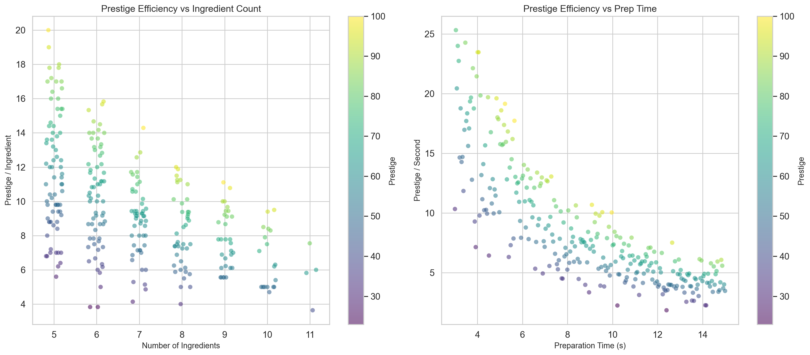

## 7. Joint Distribution Plot

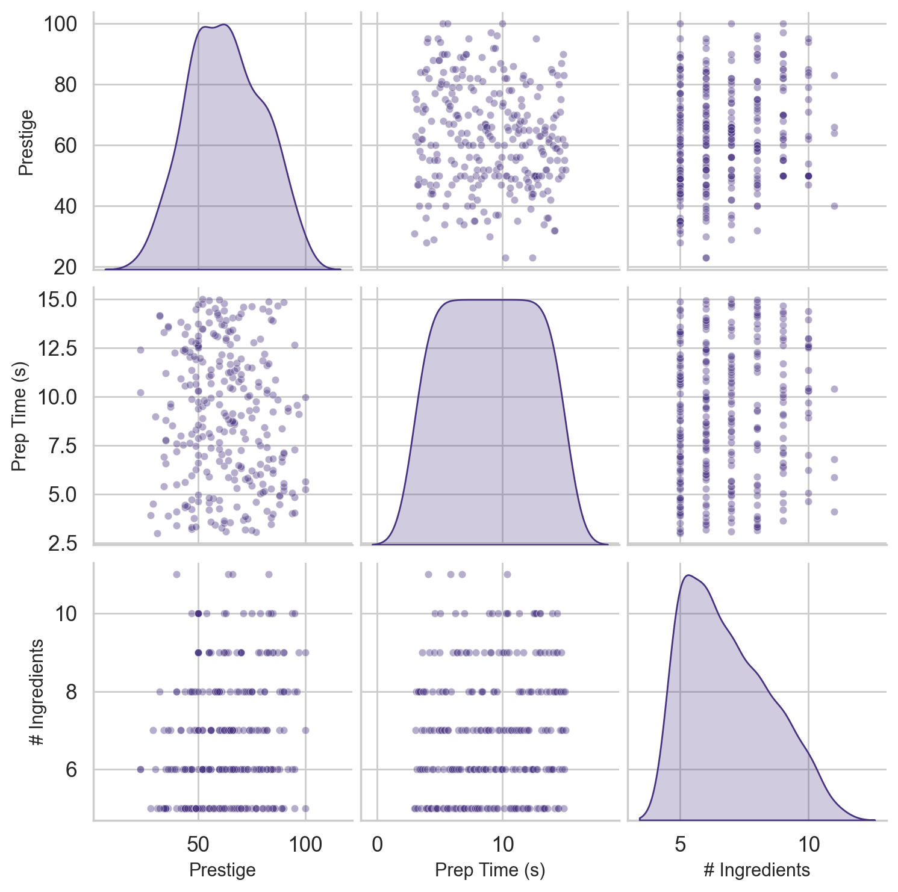

## 8. Strategic Summary & Key Findings

### Key Correlations

| Relationship | Pearson r | p-value | Interpretation |
|-------------|-----------|---------|----------------|
| # Ingredients → Prestige | 0.1704 | 3.7928e-03 | Weak |
| Prep Time → Prestige | -0.1224 | 3.8220e-02 | Weak |
| Prep Time → # Ingredients | 0.0983 | 9.6619e-02 | Weak |

### Best Value Recipes (Prestige ≥ 85, Ingredients ≤ 6)

| name                                                                                                                            |   prestige |   n_ingredients |   prep_s |   prestige_per_ing |
|:--------------------------------------------------------------------------------------------------------------------------------|-----------:|----------------:|---------:|-------------------:|
| Portale Cosmico: Sinfonia di Gnocchi del Crepuscolo con Essenza di Tachioni e Sfumature di Fenice                               |        100 |               5 |    5.224 |              20    |
| Sinfonia Temporale di Fenice e Xenodonte su Pane degli Abissi con Colata di Plasma Vitale e Polvere di Crononite                |         95 |               5 |    4.049 |              19    |
| Più-dimensionale Sinfonia di Sapori: La Carne del Cosmo                                                                         |         95 |               6 |    4.846 |              15.83 |
| Sinfonia Quantica dell'Oceano Interstellare                                                                                     |         94 |               6 |    4.007 |              15.67 |
| Sinfonia Celeste dell'Equilibrio Temporale                                                                                      |         92 |               6 |    9.42  |              15.33 |
| Sinfonia di Multiverso: La Danza degli Elementi                                                                                 |         90 |               5 |    5.559 |              18    |
| Sinfonia Aromatica del Multiverso                                                                                               |         89 |               5 |    6.65  |              17.8  |
| Viaggio Cosmico nel Multiverso                                                                                                  |         89 |               5 |    6.86  |              17.8  |
| Sinfonia Celestiale di Gnocchi del Crepuscolo                                                                                   |         88 |               6 |    4.469 |              14.67 |
| Galassia nel Piatto: Sinfonia di Sapori e Dimensioni                                                                            |         87 |               6 |    9.839 |              14.5  |
| Piastrella Celestiale di Gnocchi del Crepuscolo con Nebulosa di Riso di Cassandra, Lacrime di Unicorno e Velo di Materia Oscura |         86 |               5 |   10.846 |              17.2  |
| Sinfonia del Multiverso Calante                                                                                                 |         85 |               5 |    3.965 |              17    |
| Sinfonia Cosmica di Terracotta                                                                                                  |         85 |               5 |    6.818 |              17    |
| Sinfonia Cosmica di Andromeda                                                                                                   |         85 |               5 |    9.21  |              17    |
| Sinfonia Cosmica all'Alba di Fenice                                                                                             |         85 |               6 |   13.867 |              14.17 |

---

*Generated automatically from live game server data.*
